# Healthcare Insurance System - Architecture Documentation

This document provides comprehensive visual documentation of the healthcare insurance system architecture, workflows, and data relationships.

## Table of Contents
1. [System Architecture](#system-architecture)
2. [Database Architecture](#database-architecture)
3. [Entity Relationships](#entity-relationships)
4. [Claims Processing Workflow](#claims-processing-workflow)
5. [Insurance Plan Types](#insurance-plan-types)
6. [Business Logic Functions](#business-logic-functions)
7. [Data Flow Patterns](#data-flow-patterns)

---

## System Architecture

### High-Level Component Diagram

```mermaid
graph TB
    subgraph "GraphQL API Layer"
        GQL[Hasura DDN GraphQL Engine]
    end

    subgraph "Business Logic Layer"
        GO[Go Business Logic Connector]
        TS[TypeScript Business Logic Connector]
        PY[Python Business Logic Connector]
    end

    subgraph "Data Layer - Insurance PPO DB"
        DB1[(PostgreSQL - Insurance<br/>PPO/POS Plans)]
        DB1_TABLES[Members | Claims<br/>Providers | Eligibility<br/>Notes]
    end

    subgraph "Data Layer - Insurance HMO DB"
        DB2[(PostgreSQL - Insurance HMO<br/>HMO Plans)]
        DB2_TABLES[Members | Claims<br/>Providers | Eligibility<br/>Notes]
    end

    subgraph "Data Layer - Appointments/Prescriptions"
        DB3[(PostgreSQL - Lean DB<br/>Cross-Database Activities)]
        DB3_TABLES[Appointments<br/>Prescriptions<br/>Billing Records]
    end

    CLIENT[GraphQL Client<br/>Web/Mobile App] --> GQL
    GQL --> GO
    GQL --> TS
    GQL --> PY
    GQL --> DB1
    GQL --> DB2
    GQL --> DB3

    DB1 --> DB1_TABLES
    DB2 --> DB2_TABLES
    DB3 --> DB3_TABLES

    DB3_TABLES -.member_id.-> DB1_TABLES
    DB3_TABLES -.member_id.-> DB2_TABLES

    style GQL fill:#4287f5
    style GO fill:#00ADD8
    style TS fill:#3178C6
    style PY fill:#3776AB
    style DB1 fill:#336791
    style DB2 fill:#336791
    style DB3 fill:#336791
```

### Multi-Connector Pattern

**Why Three Business Logic Connectors?**

This project demonstrates **algorithmic equivalence** across three programming languages:
- **Go Connector**: High-performance, compiled language implementation
- **TypeScript Connector**: JavaScript ecosystem, Node.js runtime
- **Python Connector**: Data science friendly, rapid development

All three implement identical business logic for:
- `CalculateClaimRisk`: Fraud detection risk scoring
- `ProcessClaim`: Claim validation and adjudication
- `GenerateClaimSummary`: Claim summary generation
- `BatchCalculateRisk`: Batch risk analysis
- `BatchProcessClaims`: Batch claim processing

---

## Database Architecture

### Three-Database Architecture

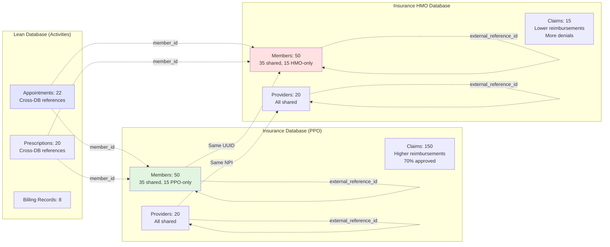

### Cross-Database Linking Strategy

The `external_reference_id` field enables cross-database queries:

| Entity | Field Purpose | Population Strategy |
|--------|---------------|---------------------|
| **Members** | Universal member identifier | Set to member UUID (35 shared members have same UUID in both DBs) |
| **Providers** | Universal provider identifier | Set to NPI (all 20 providers shared with same NPI) |
| **Claims** | Transaction correlation | NULL initially, can be populated with correlation IDs |
| **Appointments** | Activity correlation | NULL initially, linkable via member_id/provider_id |
| **Prescriptions** | Medication correlation | NULL initially, linkable via member_id/provider_id |

---

## Entity Relationships

### Core Entity Relationship Diagram

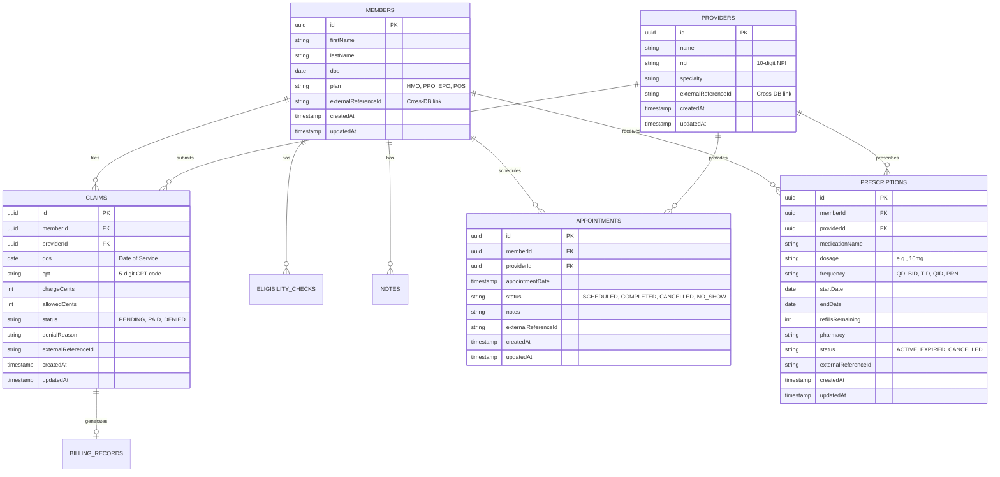

---

## Claims Processing Workflow

### Claim Lifecycle State Machine

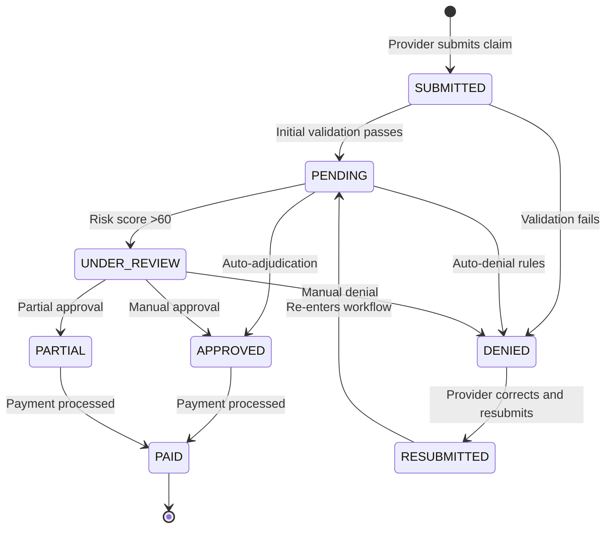

### Claims Processing Function Flow

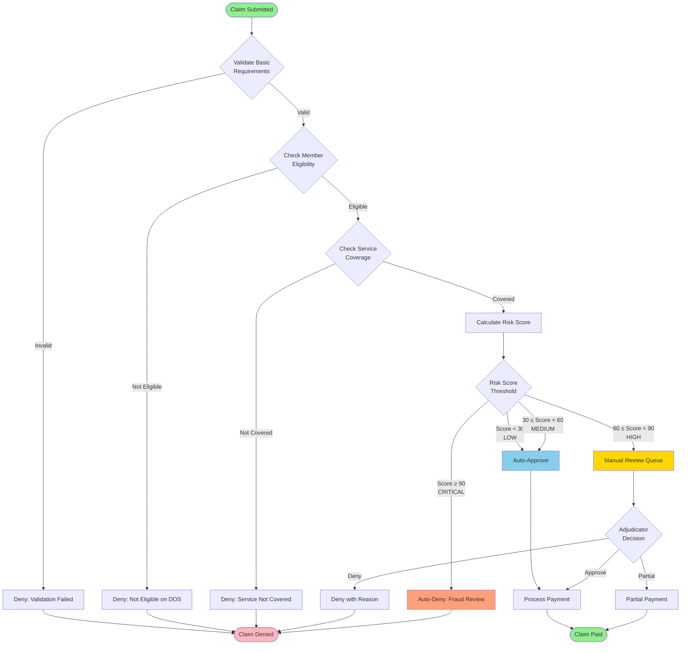

### Risk Scoring Algorithm

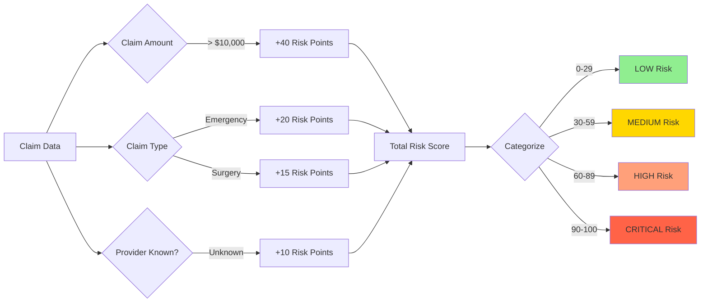

---

## Insurance Plan Types

### Plan Type Comparison

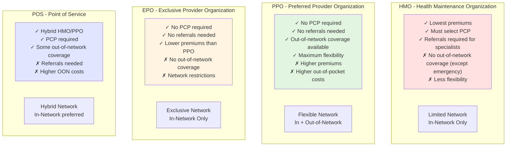

### Database Distribution by Plan Type

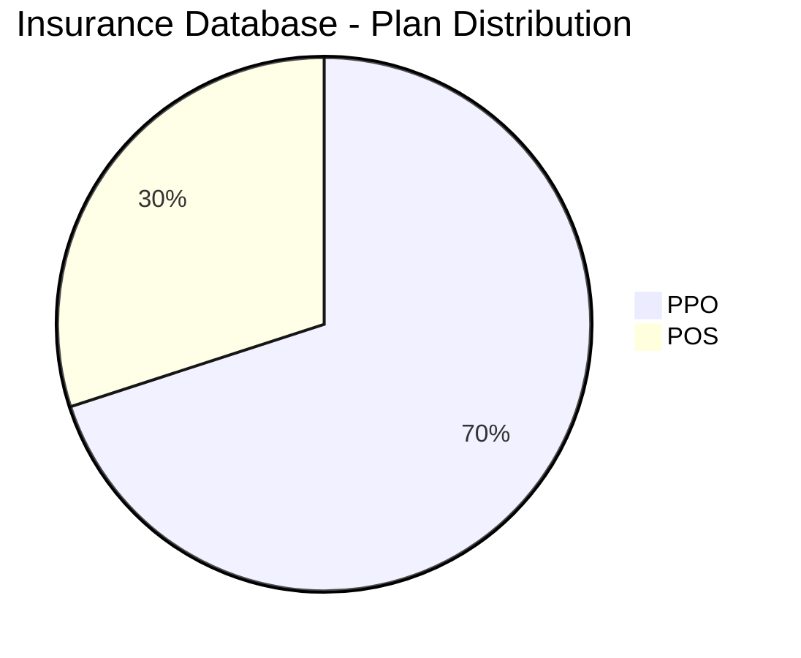

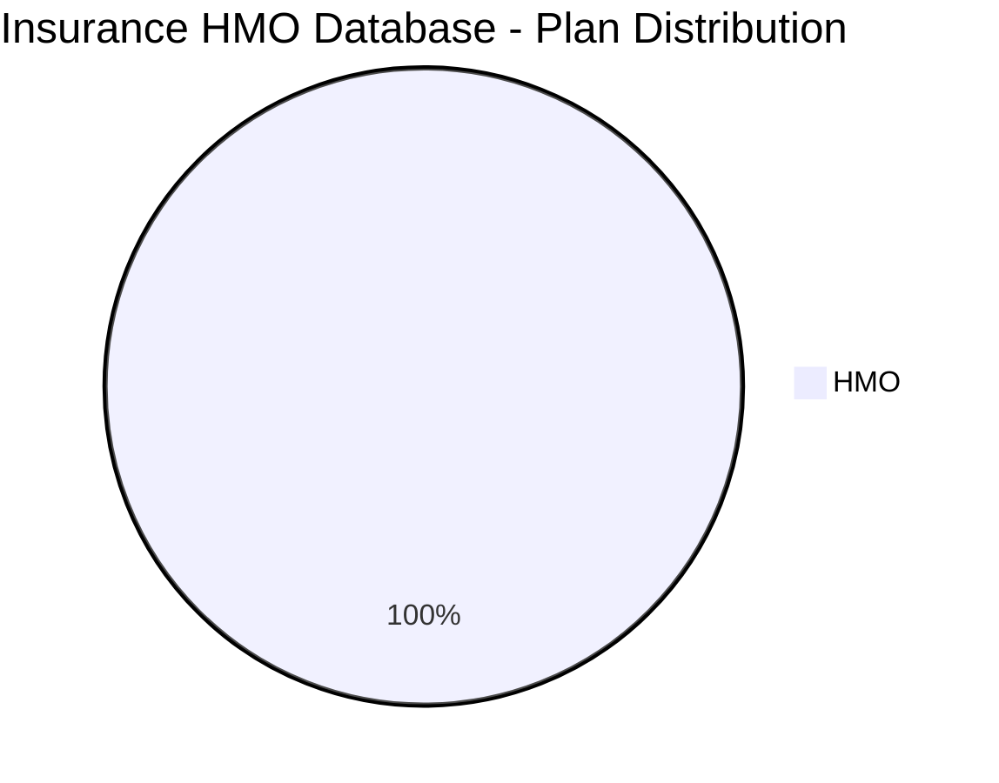

---

## Business Logic Functions

### Function Overview

```mermaid
graph TB
    subgraph "Single Claim Operations"
        CALC[CalculateClaimRisk<br/>Input: ClaimData<br/>Output: RiskScore<br/>Complexity: O(1)]
        PROC[ProcessClaim<br/>Input: ClaimData<br/>Output: ClaimProcessResult<br/>Complexity: O(1)]
        SUMM[GenerateClaimSummary<br/>Input: ClaimData<br/>Output: ClaimSummary<br/>Complexity: O(1)]
    end

    subgraph "Batch Operations"
        BATCH_RISK[BatchCalculateRisk<br/>Input: ClaimData[]<br/>Output: RiskScore[]<br/>Complexity: O(n)]
        BATCH_PROC[BatchProcessClaims<br/>Input: ClaimData[]<br/>Output: ClaimProcessResult[]<br/>Complexity: O(n)]
    end

    subgraph "Language Implementations"
        GO_IMPL[Go Implementation<br/>Performance: Fastest<br/>Compiled binary]
        TS_IMPL[TypeScript Implementation<br/>Performance: Fast<br/>Node.js runtime]
        PY_IMPL[Python Implementation<br/>Performance: Good<br/>Python runtime]
    end

    CALC --> GO_IMPL
    CALC --> TS_IMPL
    CALC --> PY_IMPL

    style CALC fill:#87CEEB
    style PROC fill:#90EE90
    style SUMM fill:#FFD700
    style BATCH_RISK fill:#DDA0DD
    style BATCH_PROC fill:#DDA0DD
```

### CalculateClaimRisk Function Flow

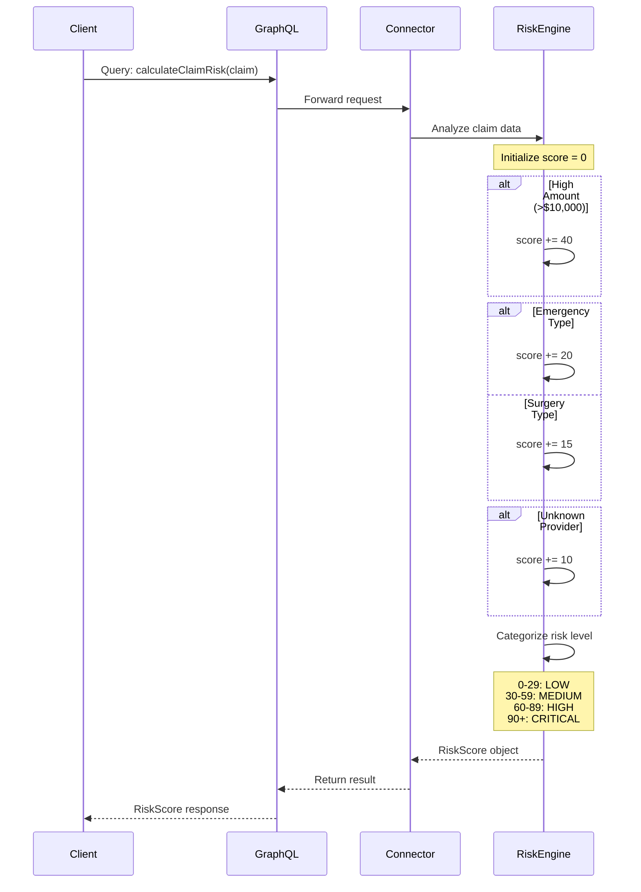

### ProcessClaim Function Flow

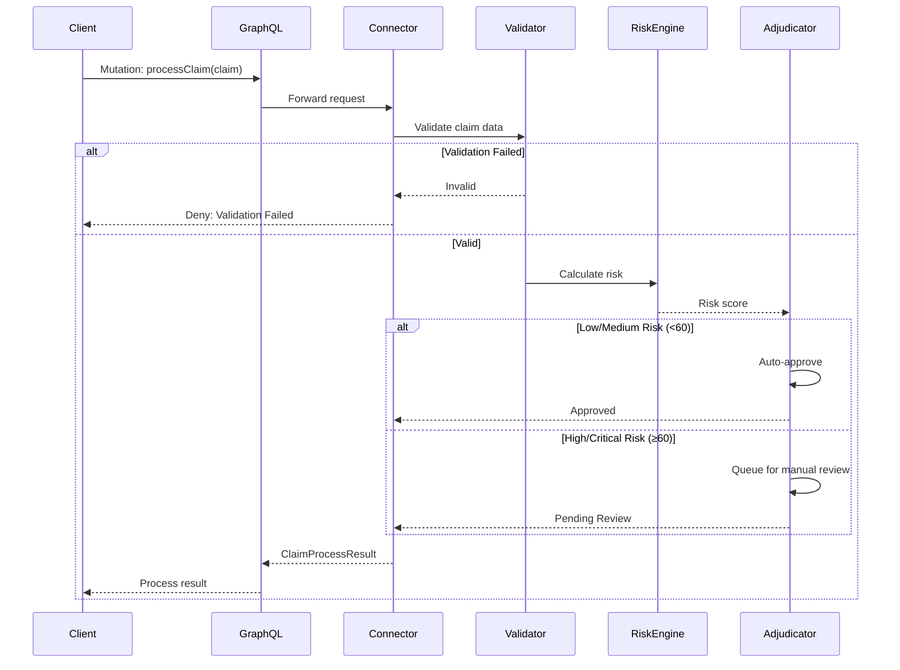

---

## Data Flow Patterns

### Federated Query Pattern

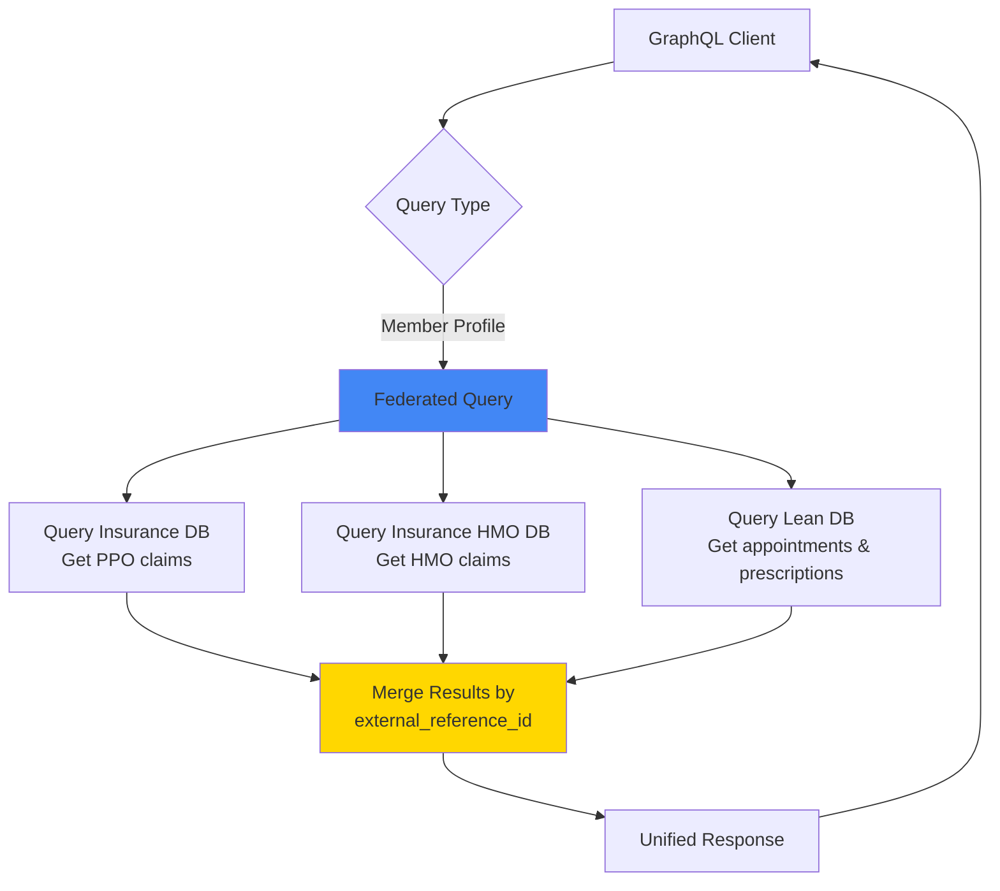

### Cross-Database Linking Example

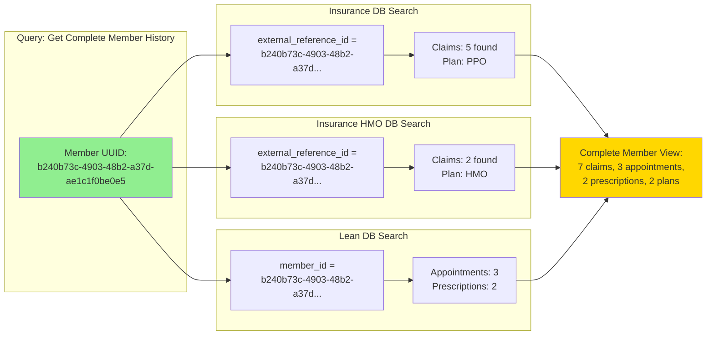

---

## Key Healthcare Concepts

### CPT Codes (Current Procedural Terminology)

5-digit standardized medical procedure codes maintained by the American Medical Association (AMA).

| Code Range | Category | Example |
|------------|----------|---------|
| 00100-01999 | Anesthesia | 01967 - Neuraxial labor analgesia |
| 10021-69990 | Surgery | 25600 - Treat closed forearm fracture |
| 70010-79999 | Radiology | 70450 - CT scan of head |
| 80047-89398 | Lab/Pathology | 80053 - Comprehensive metabolic panel |
| 90281-99607 | Medicine | 90471 - Immunization administration |
| 99201-99499 | Evaluation & Management | 99213 - Office visit (established patient) |

### NPI (National Provider Identifier)

Unique 10-digit identification number for healthcare providers required by HIPAA.

- **Type 1**: Individual providers (physicians, nurses, dentists)
- **Type 2**: Organizations (hospitals, clinics, pharmacies, insurers)
- **Format**: 10 numeric digits (e.g., 1234567890)
- **Issued by**: CMS National Plan and Provider Enumeration System (NPPES)

### Claim Amounts

**chargeCents** vs **allowedCents**:

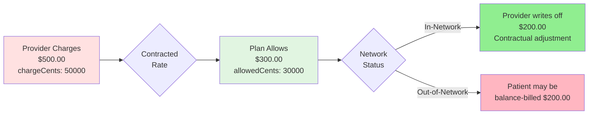

---

## Technical Implementation Notes

### Algorithmic Equivalence

All three connector implementations (Go, TypeScript, Python) are **algorithmically equivalent**:

1. **CalculateClaimRisk**: Identical risk scoring logic
   - Same base score initialization
   - Same risk factor thresholds
   - Same point additions
   - Same categorization levels

2. **ProcessClaim**: Identical validation and adjudication
   - Same validation rules
   - Same risk evaluation thresholds
   - Same approval/denial logic

3. **GenerateClaimSummary**: Identical summary formatting
   - Same data extraction
   - Same summary structure

**Purpose**: Demonstrates language interoperability and allows performance comparison while maintaining business logic consistency.

### Performance Characteristics

| Operation | Complexity | Typical Execution Time |
|-----------|------------|------------------------|
| CalculateClaimRisk | O(1) | < 1ms |
| ProcessClaim | O(1) | < 5ms |
| GenerateClaimSummary | O(1) | < 1ms |
| BatchCalculateRisk | O(n) | ~1ms per claim |
| BatchProcessClaims | O(n) | ~5ms per claim |

---

## Glossary

| Term | Definition |
|------|------------|
| **DOS** | Date of Service - when healthcare services were provided |
| **CPT** | Current Procedural Terminology - standardized medical procedure codes |
| **NPI** | National Provider Identifier - unique 10-digit provider ID |
| **HMO** | Health Maintenance Organization - managed care with PCP requirement |
| **PPO** | Preferred Provider Organization - flexible network with OON coverage |
| **EPO** | Exclusive Provider Organization - network-only, no referrals |
| **POS** | Point of Service - hybrid HMO/PPO plan |
| **PCP** | Primary Care Physician - required for HMO plans |
| **OON** | Out-of-Network - providers not contracted with the plan |
| **Adjudication** | Claims processing and decision-making |
| **Allowed Amount** | Maximum amount plan will pay for a service |
| **Balance Billing** | Charging patient the difference between charged and allowed amounts |
| **Coinsurance** | Percentage of costs paid by patient after deductible |
| **Copay** | Fixed amount paid by patient for a service |
| **Deductible** | Amount patient pays before insurance coverage begins |

---

*This documentation is auto-generated and synchronized with the GraphQL schema metadata descriptions.*
